Author: Muluh Dilane

# Claude Computer Use Agent — Scalable Backend

A production-quality **FastAPI backend** for managing Claude computer use agent sessions, replacing the experimental Streamlit interface from [Anthropic's computer-use-demo](https://github.com/anthropics/anthropic-quickstarts/tree/main/computer-use-demo).

## Interaction Flow

```mermaid
sequenceDiagram
    participant User
    participant Frontend
    participant FastAPI
    participant SessionMgr
    participant SQLite
    participant ClaudeAPI
    participant VirtualDesktop

    User->>Frontend: Create Session
    Frontend->>FastAPI: POST /api/sessions
    FastAPI->>SQLite: Save new session
    SQLite-->>FastAPI: Session ID
    FastAPI-->>Frontend: 201 Created (ID)

    User->>Frontend: Send message "Open browser"
    Frontend->>FastAPI: POST /api/sessions/{id}/message
    FastAPI->>SessionMgr: Dispatch task (background)
    FastAPI-->>Frontend: 202 Accepted
    
    rect rgb(30, 30, 45)
    Note over SessionMgr,VirtualDesktop: Agent Loop Starts
    SessionMgr->>ClaudeAPI: Messages + Tools
    ClaudeAPI-->>SessionMgr: Tool Use: computer(screenshot)
    SessionMgr->>VirtualDesktop: Take Screenshot
    VirtualDesktop-->>SessionMgr: Image Data
    SessionMgr->>FastAPI: Push SSE Event: tool_result
    FastAPI-->>Frontend: SSE: tool_result (base64 img)
    end

    User->>Frontend: View Progress
    Frontend->>VirtualDesktop: Iframe VNC (noVNC)
```



## Features

- **Session Management API** — Create, list, get, and delete agent sessions via REST
- **Real-time Streaming** — Server-Sent Events (SSE) + WebSocket for live agent progress
- **VNC Desktop Access** — Virtual desktop via noVNC, viewable from the browser
- **Database Persistence** — Chat history persisted in SQLite via async SQLAlchemy
- **Concurrent Session Support** — `asyncio.Lock` per session prevents race conditions
- **Docker Ready** — Single `docker compose up` to run everything

## Architecture

```
┌─────────────────────────────────────────────────────────────┐
│                     Docker Container                         │
│                                                              │
│  ┌──────────┐  ┌──────────┐  ┌───────────────┐              │
│  │  Xvfb    │  │  x11vnc  │  │   noVNC       │              │
│  │ :display │──│  :5900   │──│   :6080       │              │
│  └──────────┘  └──────────┘  └───────────────┘              │
│                                                              │
│  ┌──────────────────────────────────────────┐                │
│  │  FastAPI Backend (:8000)                  │                │
│  │  ├── REST API  /api/sessions/*            │                │
│  │  ├── SSE       /api/sessions/{id}/events  │                │
│  │  ├── WebSocket /ws/{id}                   │                │
│  │  └── Frontend  / (static HTML/JS/CSS)     │                │
│  └──────────────────────────────────────────┘                │
│      │                                                       │
│      ▼                                                       │
│  ┌──────────────┐  ┌────────────────────────┐                │
│  │ SessionMgr   │──│ loop.py (Claude API)   │                │
│  │ + DB (SQLite)│  │ + tools (bash,computer)│                │
│  └──────────────┘  └────────────────────────┘                │
│                                                              │
│  ┌──────────────┐                                            │
│  │ HTTP :8080   │  Combined view (chat + VNC iframes)        │
│  └──────────────┘                                            │
└─────────────────────────────────────────────────────────────┘
```

## Quick Start

### Prerequisites
- Docker and Docker Compose
- An [Anthropic API key](https://console.anthropic.com/)

### Run with Docker Compose

```bash
# 1. Navigate to the project directory
cd computer-use-demo

# 2. Set your API key
export ANTHROPIC_API_KEY=sk-ant-...

# 3. Build and run
docker compose up --build
```

### Demo Mode (No API Credits Required)

If you don't have Anthropic API credits, you can still demonstrate the **entire system architecture** (Concurrency, SSE Streaming, SQLite persistence, and UI layout) by using the built-in **Mock Mode**:

```bash
# Set USE_MOCK_AGENT to true
export USE_MOCK_AGENT=true
docker compose up --build
```
In this mode, the agent loop uses a `MockProvider` that simulates thinking and tool usage, pushing real events through the same async pipeline as the live agent.

### Run with Docker directly

```bash
docker build -t claude-agent-backend .
docker run \
    -e ANTHROPIC_API_KEY=$ANTHROPIC_API_KEY \
    -p 8080:8080 \
    -p 8000:8000 \
    -p 6080:6080 \
    -p 5900:5900 \
    -v agent-data:/data \
    -it claude-agent-backend
```

### Access Points

| URL | Description |
|-----|-------------|
| `http://localhost:8080` | **Combined view** — Chat + VNC desktop in split layout |
| `http://localhost:8000` | **Frontend** — Full-featured agent chat interface |
| `http://localhost:8000/docs` | **API Docs** — Interactive Swagger/OpenAPI documentation |
| `http://localhost:6080/vnc.html` | **Desktop** — noVNC viewer (desktop only) |
| `vnc://localhost:5900` | **VNC** — Direct VNC for VNC clients |

## API Reference

### Sessions

| Method | Endpoint | Description |
|--------|----------|-------------|
| `POST` | `/api/sessions` | Create a new session |
| `GET` | `/api/sessions` | List all sessions |
| `GET` | `/api/sessions/{id}` | Get session with messages |
| `DELETE` | `/api/sessions/{id}` | Delete session |
| `POST` | `/api/sessions/{id}/message` | Send message (requires `X-API-Key` header) |
| `GET` | `/api/sessions/{id}/events` | SSE stream for real-time events |
| `POST` | `/api/sessions/{id}/stop` | Stop running agent |
| `GET` | `/api/health` | Health check |

### WebSocket

Connect to `ws://localhost:8000/ws/{session_id}` for bidirectional chat.

**Client → Server:**
```json
{"type": "message", "content": "Take a screenshot", "api_key": "sk-ant-..."}
{"type": "stop"}
```

**Server → Client:**
```json
{"event": "text", "data": "{\"type\":\"text\",\"text\":\"I'll take a screenshot...\"}"}
{"event": "tool_use", "data": "{\"type\":\"tool_use\",\"name\":\"computer\",\"input\":{\"action\":\"screenshot\"}}"}
{"event": "tool_result", "data": "{\"screenshot\":\"base64...\"}"}
{"event": "status", "data": "{\"status\":\"idle\"}"}
{"event": "done", "data": "{\"message\":\"Agent loop completed\"}"}
```

### SSE Events

Subscribe to `GET /api/sessions/{id}/events` — the endpoint returns an SSE stream:

| Event | Description |
|-------|-------------|
| `text` | Assistant text response |
| `tool_use` | Tool invocation (name + input) |
| `tool_result` | Tool output (text, error, screenshot) |
| `thinking` | Model thinking (if enabled) |
| `status` | Session status change |
| `error` | Error details |
| `done` | Agent loop completed |
| `keepalive` | Connection keepalive (every 30s) |

### Example: Create Session and Send Message

```bash
# Create a session
curl -X POST http://localhost:8000/api/sessions \
  -H "Content-Type: application/json" \
  -d '{"name": "My Session", "model": "claude-sonnet-4-5-20250929"}'

# Send a message (replace SESSION_ID)
curl -X POST http://localhost:8000/api/sessions/{SESSION_ID}/message \
  -H "Content-Type: application/json" \
  -H "X-API-Key: sk-ant-..." \
  -d '{"content": "Open Firefox and go to google.com"}'

# Listen for SSE events
curl -N http://localhost:8000/api/sessions/{SESSION_ID}/events
```

## Design Decisions

### Concurrency Model
Each session has an `asyncio.Lock` to prevent concurrent access. Messages are queued per-session via `asyncio.Queue`, and the agent loop runs as a background `asyncio.Task`. This ensures:
- No race conditions when multiple clients interact with the same session
- Non-blocking API responses (message endpoint returns 202 immediately)
- Clean cancellation via task.cancel()

### Single Container Architecture
The agent tools (bash, computer, edit) execute directly on the container's virtual desktop. This means **each container supports one active agent at a time**. Multiple *logical* sessions can exist (with persisted chat history), but only one can actively control the desktop. For production multi-user scenarios, scale by running multiple containers behind a load balancer.

### Database
SQLite via async SQLAlchemy + aiosqlite. The database file lives at `/data/sessions.db` and is mountable as a Docker volume for persistence across container restarts.

### Streaming
- **SSE**: For unidirectional server→client streaming. Simple, works through proxies/CDNs, auto-reconnects.
- **WebSocket**: For bidirectional communication. Send messages and receive events on the same connection.

## Project Structure

```
computer-use-demo/
├── app/                          # FastAPI backend (NEW)
│   ├── main.py                   # App entry point, CORS, routes
│   ├── models.py                 # Pydantic schemas + SQLAlchemy ORM
│   ├── database.py               # Async SQLite CRUD layer
│   ├── session_manager.py        # Session orchestration + event queues
│   └── api/
│       ├── sessions.py           # REST + SSE endpoints
│       └── ws.py                 # WebSocket endpoint
├── frontend/                     # HTML/JS/CSS frontend (NEW)
│   ├── index.html
│   ├── styles.css
│   └── app.js
├── computer_use_demo/            # Original agent loop + tools (UNCHANGED)
│   ├── loop.py                   # Claude API sampling loop
│   ├── tools/                    # bash, computer, edit tools
│   └── requirements.txt
├── image/                        # Docker image scripts
│   ├── entrypoint.sh             # MODIFIED: starts FastAPI instead of Streamlit
│   └── ...                       # VNC, noVNC, xvfb scripts
├── tests/
│   ├── test_api.py               # API endpoint tests (NEW)
│   ├── test_database.py          # Database layer tests (NEW)
│   └── loop_test.py              # Original loop test (UNCHANGED)
├── Dockerfile                    # MODIFIED: copies app/ + frontend/
├── docker-compose.yml            # NEW: easy local development
└── README.md                     # This file
```

## Development

### Run Tests

```bash
# Install dev dependencies
pip install -r computer_use_demo/requirements.txt
pip install -r dev-requirements.txt

# Run all tests
pytest tests/ -v --asyncio-mode=auto

# Run specific test files
pytest tests/test_api.py -v
pytest tests/test_database.py -v
```

### Run Locally (without Docker)

The backend requires a Linux environment with X11 for the agent tools. For development:

```bash
# Start FastAPI backend
uvicorn app.main:app --host 0.0.0.0 --port 8000 --reload
```

## Architectural Design

### 1. Concurrency & Task Orchestration
The system implements a **strictly non-blocking async architecture** to manage long-running agent sessions.
- **Task Spawning**: Agent loops are dispatched via `asyncio.create_task`, isolating the FastAPI event loop from the tool-intensive sampling process.
- **Atomic State Locking**: Granular `asyncio.Lock` is enforced per `session_id`. This ensures state consistency during high-frequency interaction while allowing independent sessions to process in parallel.

### 2. State & Persistence
- **Abstraction**: Data persistence is handled via an asynchronous SQLAlchemy layer, abstracting the storage engine from the application logic. 
- **Modularity**: The system uses a local SQLite instance by default. Production deployment supports swapping the connection string to Postgres without application-layer changes.
- **Session Lifecycle**: Each session maintains an independent, persistent chat history and a volatile, in-memory event queue.

### 3. Real-Time Streaming
The backend utilizes **Server-Sent Events (SSE)** for unidirectional progress streaming.
- **Push Architecture**: The agent loop publishes updates to an internal queue; the SSE generator consumes and streams these events to the client.
- **Resiliency**: SSE provides a reliable connection for long-running tasks, featuring standard reconnection logic and transparency for upstream load balancers.

### 4. Operational Characteristics
- **Horizontal Scaling**: Achieved via container replication. Each instance owns a single virtual desktop (Xvfb) environment, establishing a clear isolation boundary for "Computer Use" operations.
- **Stateless API**: The API layer remains stateless; all session context is retrieved from the persistence layer or managed in isolated memory blocks per session ID.
- **Backpressure**: Handled via per-session event queues to prevent event drops during high-latency tool executions.

## System Boundaries & Constraints

Designing for scale requires defining explicit failure modes and operational limits:
- **Display Contention**: A single container instance provides exactly one X11 display. Simultaneous "Computer Use" tool calls within the same container compete for this shared resource.
- **Rate-Limit Boundaries**: The system is sensitive to Anthropic API Tier limits; backpressure is surfaced to the user as streaming error events.
- **Memory Profile**: Resident memory grows linearly with the number of concurrent sessions due to the in-memory event queues and SQLAlchemy session management.
- **Disk I/O**: High-frequency "Computer Use" tasks generate significant image artifacts (screenshots) that impact temporary storage performance.

## License

See [LICENSE](LICENSE).
